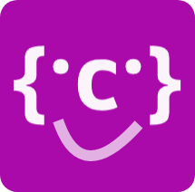

<p align="center">
  
</p>

<h1 align="center" style="color:grey;font-family:">CIQL JSON</h1>
<p style="font-size:18.5px; border-bottom:1px solid grey; padding-bottom:30px" align="justify">
    Ciql json est un outils de mainupaltion des fichier JSON. il permet d'ouvrir et de modifer un fichier json et enfin d'enregistrer le resultat dans un autre fichier ou dans le fichier courant. On peut aussi l'utiliser pour creer les fichier JSON, il est tres pratique et facile a utiliser.
</p>
<h1 style="color:#9fa8da;">Intallation</h1>

> yarn add ciql-json
> 
> npm i ciql-json

<h1 style="color:#9fa8da;">Usage</h1>


```js
const ciqlJSON = require('ciql-json')
```
<h3 id="funcopen" style="color:#ff80ab;">
<a href="#funcopen"># .open</a></h3>

<p style="font-size:16.5px">
vous utilisez la fonction <code>open</code> pour ouvrir un fichier json existant. Une fois le fichier lie vous avez access aux fontions de modification.
</p>

```js
const ciqlJson = require("ciql-json")

ciqlJson
    .open("file.json")
    .set("adress", {ville : "", commune : "", quartier : '', rue : ''})
    .save()
```
<p style="font-size:16.5px">
Si vous ne precisez pas de fichier dans la fonction set, les modifications s'effectues dans le fichier d'entre.
</p>


<h3 id="funccreate" style="color:#ff80ab;">
<a href="#funccreate"># .create</a></h3>
<p style="font-size:16.5px">
Utilisez la fonction <code>create</code> pour initialiser un object json.
</p>


```js
const ciqlJson = require("ciql-json")

ciqlJson
    .create({nom:"edy", prenoms : "koffi", age : 15})
    .set("adress", {ville : "", commune : "", quartier : '', rue : ''})
    .save()
```

<h3 id="funcsave" style="color:#ff80ab;">
<a href="#funcsave"># .save</a> </h3>
<p style="font-size:16.5px">
Utilisez la fonction <code>save</code> pour initialiser un object json.
</p>


```js
const ciqlJson = require("ciql-json")

ciqlJson
    .create({nom:"edy", prenoms : "koffi", age : 15})
    .set("adress", {ville : "", commune : "", quartier : '', rue : ''})
    .save()
```

<h3 id="funcset" style="color:#ff80ab;">
<a href="#funcset">#  .set</a></h3>

<p style="font-size:16.5px">
Utilisez la methode <code>set</code> pour ajouter ou modifier les valeur de l'objet JSON
</p>


```js
const ciqlJson = require("ciql-json")

ciqlJson
    .create({})
    .set("school", "ESATIC")
    .set("location", "Treichville")
    .set("adress", "")
    .save('data.json')

//output file (data.json): {age : 15, adress : {ville : "", commune : "", }}
```

<p style="font-size:16.5px">
Vous pouvez fixer la valeur d'une cle profonde, cela depend de vous. Faites comme suit : 
</p>

```js
const ciqlJson = require("ciql-json")

ciqlJson
    .create({})
    .set("school", "ESATIC")
    .set("location.ville", "Treichville")
    .save('data.json')

//output file (data.json): {schol : "ESATIC", location : {ville : "Treichville",}}
```


<h3 id="funcextract" style="color:#ff80ab;">
<a href="#funcextract">#  .extract</a></h3>
<p style="font-size:16.5px">
Extract format in json file suivant le modele de destructuration *ES6*
</p>

```js
const ciqlJson = require("ciql-json")

ciqlJson
    .create({nom:"edy", prenoms : "koffi", age : 15})
    .set("adress", {ville : "", commune : "", })
    .extract("{ age, adress }")
    .save('data.json')

//output file (data.json): {age : 15, adress : {ville : "", commune : "", }}
```

<h3 id="funcgetData" style="color:#ff80ab;">
<a href="#funcgetData"># .getData</a></h3>

<p style="font-size:16.5px">
Utiliser <code>getData</code> si vous voulez retourner la valeur finale du json dans une variable.
</p>


```js
const ciqlJson = require("ciql-json")

const data = ciqlJson
                .create({})
                .set("school", "ESATIC")
                .set("location", "Treichville")
                .getData()

//output : data = {school : "ESATIC", location : "Treichville"}
```

<p align="center" style="font-size:12.5px">
LICENSE <code>MIT</code>
</p>